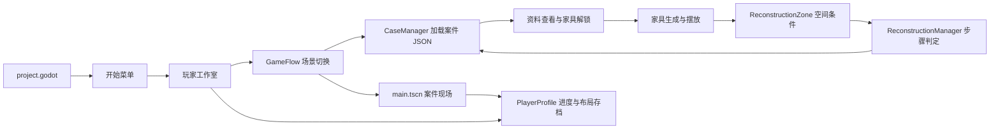

# 错位现场 · 源码审核导览

这是一个 Godot 4.7 / GDScript 项目。完整工程包含脚本、场景、案件数据、着色器、模型、图片和验证工具。可先阅读本页，再打开对应源文件；下载完整工程后，也可以直接双击 `review/index.html` 离线浏览源码。

## 启动与运行

1. 用 Godot 4.7 打开根目录 `project.godot`，等待首次资源导入。
2. 按 F6 运行当前场景，或按 F5 从工程启动入口运行。
3. 启动入口是 `scenes/start_menu/start_menu_office.tscn`，不是案件主场景。
4. 开始菜单进入 `scenes/studio/calibrator_studio.tscn`。接取案件后，`GameFlow` 加载对应案件 JSON，再切换到 `scenes/main.tscn`。

工程当前使用 `gl_compatibility` 渲染方式。`project.godot` 中的配置是实际运行配置。

## 目录结构

| 目录 / 文件 | 职责 | 建议先看 |
|---|---|---|
| `project.godot` | 启动入口、Autoload、窗口与渲染设置 | `[application]`、`[autoload]` |
| `scripts/` | 游戏逻辑与运行时 UI | `game_flow.gd`、`main.gd` |
| `scenes/` | Godot 场景层级与节点配置 | `start_menu/`、`studio/`、`main.tscn` |
| `data/cases/` | 案件线索、资料、解锁、重构步骤 | `office_case_001.json` |
| `data/progression/` | 案件进程与工作室商品 | `campaign.json`、`studio_catalog.json` |
| `data/localization/` | 界面与案件文案的英文翻译 | `en.json` |
| `data/audio/`、`assets/audio/` | 音效配置与声音资源 | `docs/AUDIO_PACK.md` |
| `assets/` | 模型、贴图、字体、照片和 UI 图集 | `models/`、`ui/`、`case_photos/` |
| `materials/`、`shaders/` | 材质资源与手绘画面效果 | `.tres`、`.gdshader` |
| `tests/` | 功能检查与预览截图 | `smoke_*.gd` |
| `tools/` | 场景拆分、资源处理、渲染与交付工具 | `build_source_review.py` |
| `design/` | 设计稿与界面参考 | SVG、预览图片 |
| `docs/`、`review/` | 审核说明、完整源码浏览页与文件清单 | 本页、`review/index.html` |

## 模块关系

## 核心模块索引

| 功能 | 源文件 | 审核关注点 |
|---|---|---|
| 场景切换与游戏流程 | `scripts/game_flow.gd`、`scripts/scene_transition.gd` | 案件选择、切场景、过渡动画 |
| 案件与线索状态 | `scripts/case_manager.gd` | JSON 读取、资料查看、线索去重、家具解锁信号 |
| 案件场景交互 | `scripts/main.gd` | 拖放、选中、镜头、灯光、收纳、旋转与输入路由 |
| 家具创建 | `scripts/furniture_factory.gd`、`scripts/studio_furniture_factory.gd` | 资源实例化、占地、碰撞与吸附配置 |
| 空间重构判定 | `scripts/reconstruction_zone.gd`、`scripts/reconstruction_manager.gd` | 位置 / 朝向条件、步骤组合、一次性线索奖励 |
| 场景调查点 | `scripts/scene_clue_point.gd`、`scripts/scene_clue_popup.gd` | 观察角度、遮挡检测、调查与线索展示 |
| 案件资料与结算 | `scripts/case_file_ui.gd`、`scripts/case_archive_view.gd`、`scripts/first_case_flow_ui.gd` | 资料选择、照片 / 正文、委托与结算界面 |
| 工作室 | `scripts/calibrator_studio.gd`、`scripts/studio_computer_ui.gd` | 布置、楼层、库存、邮箱、商店与案件入口 |
| 存档 | `scripts/player_profile.gd` | 玩家进度、货币、库存、布局与存档读写 |
| 家具图标 | `scripts/catalog_item.gd`、`scripts/furniture_icon_library.gd` | 透明图集区域、等比显示、拖拽信号 |
| 暂停 | `scripts/pause_menu.gd` | 全局暂停、继续与返回菜单 |
| 界面语言 | `scripts/game_language.gd`、`scripts/ui_translation.gd` | 默认英语、语言偏好保存、原生控件与动态文字翻译 |
| 电脑桌面与邮件 | `scripts/terminal_app_window.gd`、`scripts/terminal_mail_client.gd` | 独立窗口、拖动、最大化 / 还原、最小化、任务栏与阅读状态 |
| 游戏音效 | `scripts/game_audio.gd` | 事件播放、空间音效、音量设置、淡入淡出与暂停 |

`main.gd` 和 `calibrator_studio.gd` 是较大的场景控制器；离线浏览页提供函数目录，可以直接跳到具体函数。`.tscn` / `.tres` 可按文本审阅；`.scn`、GLB 和图片属于资源文件，需用 Godot 或对应资源工具查看，完整工程中保留原文件。

## 案件数据

- 第一案：`data/cases/office_case_001.json`。
- 第二案：`data/cases/gallery_case_002.json`。
- 玩家工作室是接案与布置中心，不作为调查关卡。当前正式案件只有办公室与文物修复室。
- `data/cases/apartment_case_003.json` 是保留的旧实验数据，不作为正式关卡展示。
- 案件数据中的 `clues`、`evidence`、`furniture_unlocks`、`reconstruction_steps` 对接案件管理器与重构管理器。

## 验证与交付

`tests/` 中包含不同功能的历史与当前验证脚本，不能把“文件存在”视为全部测试通过。具体修改的验证结果应以对应测试实际运行日志为准。部分工具会改写场景或保存截图，运行前应阅读脚本。

离线浏览页的文件清单记录路径、字节数与 SHA-256；源码文本带行号、函数 / 节点索引和跨文件搜索。浏览页由 `tools/build_source_review.py` 从实际工程生成，没有另行改写源码。

源码交付不包含 `.godot/` 导入缓存、Git 内部目录、`Backups/` 历史备份或 `deliveries/` 生成的压缩包。模型、图片、导入设置和 `.uid` 保留，Godot 首次打开时会重新建立缓存。

英文功能索引见 [CODE_REVIEW.md](CODE_REVIEW.md)。六页展示文件位于 [design/presentation/](../design/presentation/README.md)，代码页包含六个系统与 81 行源码摘录；最后一页用实机截图展示接案到归档的流程。来源清单记录实际源文件、行号与截图方法。
